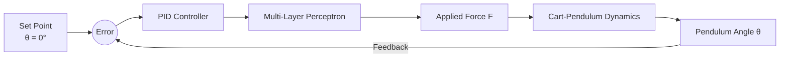

# Inverted Pendulum with ANN and PID Control

## Overview

This project implements an **Inverted Pendulum Control System** using a combination of **Artificial Neural Networks (ANN)** and **PID Control**. The simulation models the classical cart-pendulum problem, where a pendulum mounted on a moving cart must be stabilized in its upright position.

The application was developed using **Embarcadero Delphi (Object Pascal)** as part of the **Fundamentals of Intelligent Systems** course at Institut Teknologi Sepuluh Nopember (ITS).

The ANN is used to update the force applied to the cart, while the PID controller improves system stability and response performance. Numerical integration of the pendulum dynamics is performed using the Runge-Kutta method.

---

## Features

### Inverted Pendulum Simulation

* Cart and pendulum dynamic modeling
* Real-time pendulum angle visualization
* Adjustable physical parameters
* Stability analysis

### Artificial Neural Network (ANN)

* Multi-Layer Perceptron (MLP)
* Feed-forward architecture
* Backpropagation learning
* Force estimation for cart control

### PID Controller

* Proportional (P) Control
* Integral (I) Control
* Derivative (D) Control
* Comparison between controlled and uncontrolled systems

### Numerical Methods

* Runge-Kutta integration
* Dynamic state updates
* Real-time simulation

### Performance Monitoring

* Proportional Error graph
* Integral Error graph
* Derivative Error graph
* Force response visualization
* Iteration count analysis

---

## System Architecture



---

## Theoretical Background

### Multi-Layer Perceptron (MLP)

The neural network consists of:

* Input Layer
* Hidden Layer(s)
* Output Layer

The ANN is responsible for updating the force applied to the cart based on system conditions and control errors.

### PID Controller

The control system combines:

#### Proportional Control (P)

Provides corrective action proportional to the current error.

#### Integral Control (I)

Eliminates steady-state error by accumulating past errors.

#### Derivative Control (D)

Predicts future error based on the rate of change.

The combination of these three components enables stable pendulum balancing.

### Runge-Kutta Method

The simulation uses the Runge-Kutta numerical integration method to solve the nonlinear differential equations describing pendulum motion.

---

## Simulation Parameters

Default simulation parameters:

| Parameter         | Value |
| ----------------- | ----- |
| Pendulum Length   | 2 m   |
| Object Mass       | 1 kg  |
| Initial Angle (θ) | 0°    |
| Alpha             | 10    |
| Gain              | 2     |

Where:

* **Alpha** is used as a parameter within the ANN.
* **Gain** amplifies the force applied to the cart.

---

## Experimental Results

### Without PID Control

The pendulum falls due to gravity and eventually reaches a stable downward position.

Observations:

* No balancing capability
* Large steady-state error
* High iteration count before stabilization

### With PID Control

The pendulum is successfully balanced around the upright position.

Observations:

* Faster stabilization
* Reduced error
* Smaller control force over time
* Improved system performance

For an initial angle of 15°:

| Mode        | Iterations to Steady State |
| ----------- | -------------------------- |
| Without PID | 2762                       |
| With PID    | 267                        |

For larger initial angles, the controller requires more corrective force but still stabilizes the pendulum effectively.

---

## Parameter Analysis

The report evaluates several system parameters:

### Pendulum Length

Increasing pendulum length increases the time required to reach steady state.

### Object Mass

Larger masses require longer stabilization times.

### Pendulum Mass

Changes in pendulum mass affect system dynamics and convergence speed.

### Alpha

Higher alpha values improve convergence and reduce stabilization time.

### Gain

Higher gain values improve response speed and reduce settling time.

---

## Technologies Used

| Technology                | Description             |
| ------------------------- | ----------------------- |
| Object Pascal             | Programming Language    |
| Embarcadero Delphi        | Development Environment |
| Artificial Neural Network | Intelligent Control     |
| Multi-Layer Perceptron    | ANN Architecture        |
| PID Controller            | Feedback Control        |
| Runge-Kutta               | Numerical Solver        |

---

## Project Structure

```text
InvertedPendulumANN/
│
├── Source/
│   ├── Forms
│   ├── Units
│   ├── ANN Module
│   ├── PID Controller
│   └── Simulation Engine
│
├── Documentation/
│   └── Report_INVERTED_PENDULUM_WITH_ANN.pdf
│
└── README.md
```

---

## Learning Objectives

This project demonstrates:

* Artificial Neural Networks (ANN)
* Multi-Layer Perceptron (MLP)
* Backpropagation Learning
* PID Control Systems
* Dynamic System Modeling
* Runge-Kutta Numerical Methods
* Inverted Pendulum Stabilization
* Intelligent Control Systems

---

## Reference

The complete theoretical derivation, implementation details, and experimental results are documented in:

**Report_INVERTED_PENDULUM_WITH_ANN.pdf**

---

## Author

**Windy Deftia M**
Created in 2018

Biomedical Engineering
Institut Teknologi Sepuluh Nopember (ITS)

---

## License

This project was developed for educational and research purposes.
